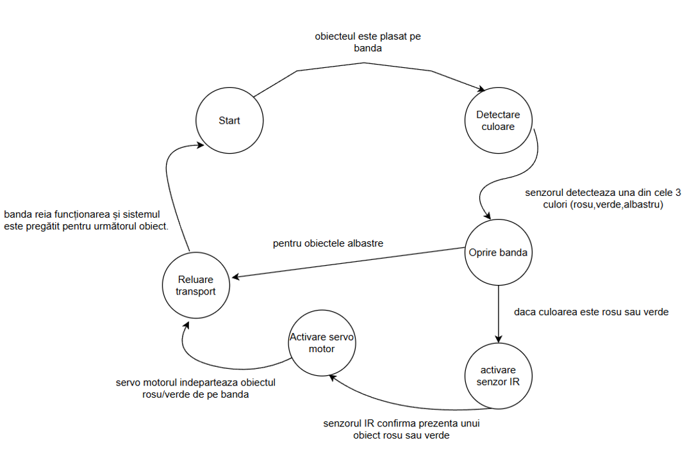
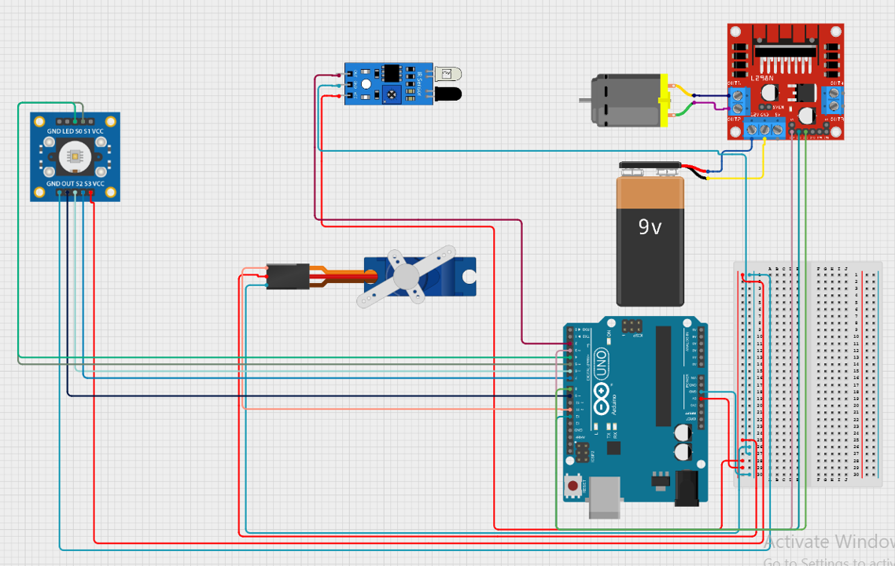
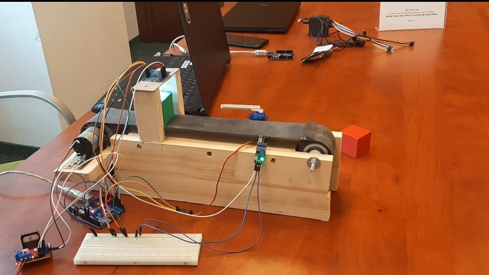

# Sistem de sortare pe baza de culoare

## Prezentare Generala

Obiectivul principal al acestui proiect constă în sortarea obiectelor, reprezentate în acest caz de cuburi, în funcție de culoare. Sistemul propus include o bandă rulantă acționată de un motor electric de curent continuu, responsabil pentru mișcarea continuă a benzii. Detectarea culoriilor se va face cu ajutorul unui senzor de culoare si un servo-motor care modifica traseul pe care merg obiectele in functie de culoare.

Acest proiect este relevant, întrucât reflectă o gamă diversă de utilaje și sisteme utilizate pe scară largă în majoritatea sau chiar în toate fabricile. Transportoarele pentru sortarea culorilor joacă un rol esențial în procesarea mărfurilor produse în masă, contribuind semnificativ la eficiența și calitatea producției.

## Caracteristici

* Sortarea automată a obiectelor în funcție de culoare
* Detectarea precisă a culorilor cu senzorul de culoare
* Bandă rulantă acționată de un motor electric de curent continuu
* Schimbarea traseului obiectelor cu ajutorul unui servo_motor

## Componente Hardware

* Arduino Uno
* Senzor de culoare TCS3200
* Senzori IR
* Motor electric de curent continuu de 12v pentru banda rulantă
* Servo-motor pentru direcționare
* Adaptor de 12v folosit ca sursă de alimentare

## Schema Logică

## Arhitectura Hardware

### Video Demonstrativ

